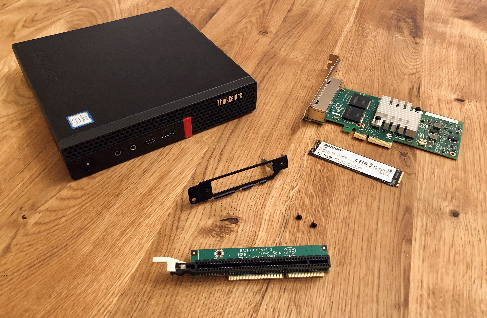

Few months ago I started looking for a router which could replace my current [Ubiquity EdgeRouter X](https://www.ui.com/edgemax/edgerouter-x/) (ER-X). Nothing in particular is wrong with the ER-X, it's a great small router that I've used for the last 2.5 years. Especially for the price I paid (~€50 new). 

In addition to the ER-X I also have one Ubiquity AP ([UniFi nanoHD](https://unifi-nanohd.ui.com/)) and plan to get one more with Wi-Fi 6 ([UniFi 6 Lite](https://eu.store.ui.com/collections/unifi-network-access-points/products/unifi-ap-6-lite)). 

Things I was looking for in the router:
* Route gigabit WAN connection
* Ability to do IPS/IDS at gigabit speed (not really necessary but would be interesting to try out)
* OpenVPN client connection at decent speed
* Have a OpenVPN server to connect from outside the network
* Future proof

Previously I thought about  [UniFi Security Gateway](https://www.ui.com/unifi-routing/usg/). It would have a good integration with my current AP but it's already quite old (released in 2014) and underpowered.

After doing quite a bit of research I narrowed down the potential options to two:
1. Buying [UniFi Dream Machine Pro](https://eu.store.ui.com/collections/unifi-network-routing-switching/products/udm-pro) 
   Costs ~€360. I would also need a rack to mount it which would take more space and would need some additional investments as well. Initial reviews also points out some bugs with the UDM-Pro firmware but those are getting fixed with every update of firmware
2. Building your [pfSense](https://www.pfsense.org/) machine
    

I've chosen the second option. In addition to pfSense being a very capable routing option it also sounded like a good DYI project and a way to to learn more about networking.

## Building your pfSense machine

What is pfSense? This is a quote from their website:
> pfSense® software is a free, open source customized distribution of FreeBSD specifically tailored for use as a firewall and router that is entirely managed via web interface.

Time to find some hardware to run this free open source routing software. Looks like general consensus for pfSense machines are these:
* Used 1U server. I've found multiple discussions recommending Dell R210 II. Even though it was released back in 2011 it is quiet, compact and powerful enough. Would also need additional expansion network card with more network ports
* Used desktop PC with additional expansion network card with more network ports
* Small intel atom or Core (with AES-NI support) based PC with more network ports out of the box

I almost went with Dell R210 II option as I saw few used ones for €150 each. But choosing a rack-mounted server would mean that I would need to invest into server rack (same as with UDM-Pro). 

*Bonus find while looking into rack mounting: [Using IKEA Lack table to build a LackRack is a thing](https://wiki.eth0.nl/index.php/LackRack).*

Small ready build machines for pfSense costs €250-€400 (you might also get to pay some customs taxes on top if buying from China). For this you get not a very powerful machine without much upgrade options. I saw people recommending brands like Protectli (from Amazon) or Qotom (from AliExpress) but I'm sure there are many other suitable machines. 

Some examples:

The third option - buying a used desktop PC at first sight sounded like a most cost effective solution. And the most eco friendly as you would be re-purposing an used item. You spend €50-€100 on PC, add a network card for another €30 and call it a day. But as it will be quite an old desktop you have no guarantees on how long it will run and energy efficiency is sub-par. And it takes more space than a mini PC.

And here comes the ultimate solution:
Finding a decent specced used and not too old mini PC which has PCIe expansion slot for the network card. 

## Lenovo M720q: one PC to route them all

Used Lenovo M720q checked all the boxes:
* Small (179mm x 182.9mm x 34.5mm)
* Quiet and power efficient (usually comes with 65W power brick)
* Can be easily repurposed to either run some docker based home server (would be great fit to replace my current Lenovo T430 running Plex and some other docker containers) or as a home computer with screen connected
* PCIe slot
* Future proofed. Can add up to 32GB RAM officially (64GB unofficially is supported as well). Also throwing in 10gig card in that PCIe slot could be an option.

And it was not even that hard to find. I've got a used one for €275. Specs:
> 128GB SSD 2.5" 
> 8GB DDR4 RAM 
> Intel i3-9300T processor 
> NVMe slot 
> PCI-e expansion slot 
> Warranty until 2022

So far so good? Yes, but there's a catch: apparently to add a PCIe card to M720q you need a proprietary riser card from Lenovo. So now I had a Lenovo tiny PC on my desk and no way to add additional network card (which was the whole point of buying this M720q). 
Furthermore adding expansion card to the M720q takes the space of the 2.5 SATA SSD. At least this PC has a NVM.e slot, but now I need to get NVMe SSD as well.
Back to the drawing board.

Lenovo are actually selling M720q fitted with Intel I350-T4 4 port network card in USA. And you can add 4 port network card during the configuration of your new M720q with a discount for $120.

Alternatively a separate kit exists to upgrade existing M720q. Would be a perfect option but the kit costs $329.99  (~€270, almost the same as I paid for my M720q).

The kit contains 3 parts which I needed:
- Riser card, part numbers **01AJ929** (**01AJ940** could also be used in M720q)
- Proprietary bracket to neatly fit the card on the back. I wasn't able to identify the part number for this
- Intel I350-T4, part number **00YK613**. Not strictly necessary as I'm planning to go with cheaper I340-T4. More info down below in section about network cards.

I've found some of the raiser cards listed in Lenovo part seller pages but for some reason that bracket does not have any part number and there is no way to get it without the kit (looked in eBay, AliExpress, Banggood, etc.). I tried contacting authorized Lenovo service and see if I could get the official kit and how much it would cost in Europe. The answer - the kit is not sold here and my M720q could not be upgraded with this option. Also the suggestion to try getting riser card and network card from authorized resellers but this would still leave me without that bracket.

While googling around I found [a post on SFF.network forum](https://smallformfactor.net/forum/threads/lenovo-m720q-tiny-router-firewall-build-with-aftermarket-4-port-nic.14793/). It mentions an interesting option - buying bracket and riser card in China's [Taobao](https://world.taobao.com/) (something like chinese ebay that usually ships only in China) and use shipping agent ([Superbuy](https://www.superbuy.com/en/)) and get it shipped to Europe. And the post contained all the info that I needed. It also contains all the information you need to get it. Would have saved me some time finding this post earlier but better later than never. Great, back on track! 

## Taobao shopping experience

1. Find the item item on Taobao and open it via Superbuy. [Direct link](https://www.superbuy.com/en/page/buy?nTag=Home-search&from=search-input&url=https%3A%2F%2Fitem.taobao.com%2Fitem.htm%3Fspm%3Da230r.1.14.37.401d27f973jIA1%26id%3D612099329056%26ns%3D1%26abbucket%3D8%23detail) to the one I've ordered. At this step you pay for the item and local shipping
   
2. Order gets shipped from the seller and arrives to Superbuy warehouse
      
3. Parcel is processed, 3 photos are taken and uploaded for your evaluation. If everything is as expected you can submit it for shipping from China
   
4. Select shipping method, pay the estimated price and parcel will be shipped to your country
   

I've chosen NL Post Air Mail (Registered) shipping and it arrived in 23 days (17 working days). Perfectly in line with indicated 10-30 working days transit.

## Choosing the network card

I was choosing between Intel I340-T4 and Intel I350-T4 4 port gigabit network cards. They are universally recommended throughout internet for pfSense due to good support on openbsd and availability on second hand market. 

There is quite a few OEM branded options as well which has same Intel chips on-board. [Full list of branded network cards](https://forums.servethehome.com/index.php?threads/list-of-nics-and-their-equivalent-oem-parts.20974/).

I350-T4 is a newer one and supports SR-IOV (not strictly needed for my use case as all network ports will be used by pfSense). Also it is much more expensive than I340-T4. On ebay I only found I350-T4 starting at ~€60 used. 

One thing to note - according to internet I350-T4 a is target of counterfeiters (especially if listed as **new**) and you can't be sure what you are getting until you open your shipped package. [More info on fake I350-T4 cards](https://forums.servethehome.com/index.php?threads/comparison-intel-i350-t4-genuine-vs-fake.6917/).

I myself went IBM branded (FRU 94Y5167 / SN 49Y4241) I340-T4. The cost was generally in line with other Intel I340-T4 cards and should not be blocked by Lenovo BIOS. Not sure if Lenovo has any whitelisting of network cards in M720q though but better safe than sorry.

## Putting it all together

### Final Price
| Item  | Price|
|:------|:-----|
| Lenovo ThinkCentre M720q (used) | €275 (+ €4 shipping) |
| PCIe riser + bracket | €37.93 (+ €4.31 shipping) |
| IBM branded Intel I340-T4 (used) | €14.90 (+ €11.39 shipping) |
| Patriot P300 NVMe SSD 128 GB (new) | €26.39 |
| **Total** | **€373.92** |

All in all - more expensive than expected and totally not the cheapest option for pfSense. Still comes down cheaper than UDM-Pro which at the time of writing is selling for €385.99 on UniFi Europe store. 

Would it be easier to just by UDM-Pro? Definitely! Do I regret going with custom router path? For sure not! Next on the list is setting-up the actual routing software (pfSense) on this machine. 

Want to know more about the M720q? [Here's a good video review of it on YouTube](https://www.youtube.com/watch?v=KqqAs41DSUg).
